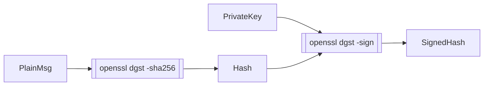
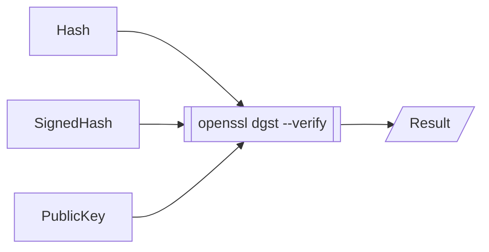

# Overview
Creation of public and private keys not shown.
## Signing

```mermaid
flowchart LR
PrivateKey-->opensslsign
PlainMsg-->openssldgst[[openssl dgst -sha256]]-->Hash-->opensslsign[[openssl dgst -sign]]-->SignedHash
```
## Verifying

```mermaid
flowchart LR
Hash-->opensslverify[[openssl dgst --verify]]-->res[/Result/]
SignedHash-->opensslverify
PublicKey-->opensslverify
```

# examples
## command line
```
cd bash
./ecdsa.sh
``` 

