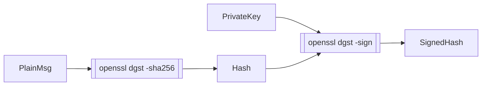
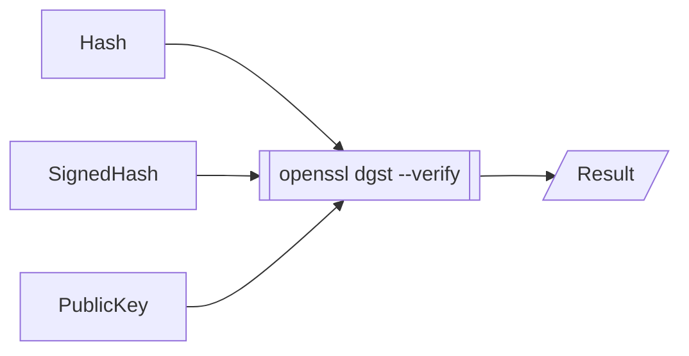

# Overview
Creation of public and private keys not shown.
## Signing

## Verifying


# CMS content for verification

- Generated using 

    ``` 
    openssl cms \
        -sign \
        -md sha256 \
        -signer ./test/certs/rootCA.pem \
        -inkey ./test/certs/rootCA.key \
        -nodetach \
        -outform DER \
        -in ./in.txt \
        -out out.der \
        -nosmimecap 
    ```

- Dumped:

    ```
    CMS_ContentInfo: 
    contentType: pkcs7-signedData (1.2.840.113549.1.7.2)
    d.signedData: 
        version: 1
        digestAlgorithms:
            algorithm: sha256 (2.16.840.1.101.3.4.2.1)
            parameter: <ABSENT>
        encapContentInfo: 
        eContentType: pkcs7-data (1.2.840.113549.1.7.1)
        eContent: 
            0000 - 48 65 6c 6c 6f 20 57 6f-72 6c 64 0d 0a         Hello World..
        certificates:
        d.certificate: 
            cert_info: 
            version: 2
            serialNumber: 9818737567723099546
            signature: 
                algorithm: sha256WithRSAEncryption (1.2.840.113549.1.1.11)
                parameter: NULL
            issuer: C=AU, ST=Some-State, O=Internet Widgits Pty Ltd, CN=rootCA
            validity: 
                notBefore: Jul  2 13:15:11 2015 GMT
                notAfter: Jul  2 13:15:11 2035 GMT
            subject: C=AU, ST=Some-State, O=Internet Widgits Pty Ltd, CN=rootCA
            key:           X509_PUBKEY: 
                algor: 
                algorithm: rsaEncryption (1.2.840.113549.1.1.1)
                parameter: NULL
                public_key:  (0 unused bits)
                0000 - 30 82 01 0a 02 82 01 01-00 c0 f1 6b 77 88   0..........kw.
                000e - ac 35 df fb 73 53 2f 92-80 2f 74 16 32 4d   .5..sS/../t.2M
                001c - f5 10 20 6f 6c 3a 8e d1-dc 6b e1 2e 3e c3   .. ol:...k..>.
                002a - 04 0f bf 9b c4 c9 12 d1-e4 0b 45 97 e5 06   ..........E...
                0038 - cd 66 3a e1 e0 e2 2b df-a2 c4 ec 7b d3 3d   .f:...+....{.=
                0046 - 3c 8a ff 5e 74 a0 ab a7-03 6a 16 5b 5e 92   <..^t....j.[^.
                0054 - c4 7e 5b 79 8a 69 d4 bc-83 5e ae 42 92 74   .~[y.i...^.B.t
                0062 - a5 2b e7 00 c1 a9 dc d5-b1 53 07 0f 73 f7   .+.......S..s.
                0070 - 8e ad 14 3e 25 9e e5 1e-e6 cc 91 cd 95 0c   ...>%.........
                007e - 80 44 20 c3 fd 17 cf 91-3d 63 10 1c 14 5b   .D .....=c...[
                008c - fb c3 a8 c1 88 b2 77 ff-9c db fc 6a 44 44   ......w....jDD
                009a - 44 f7 85 ec 08 2c d4 df-81 a3 79 c9 fe 1e   D....,....y...
                00a8 - 9b 93 16 53 b7 97 ab be-4f 1a a5 e2 fa 46   ...S....O....F
                00b6 - 05 e4 0d 9c 2a a4 cc b9-1e 21 a0 6c c4 ab   ....*....!.l..
                00c4 - 59 b0 40 39 bb f9 88 ad-fd df 8d b4 0b af   Y.@9..........
                00d2 - 7e 41 e0 21 3c c8 33 45-49 84 2f 93 06 ee   ~A.!<.3EI./...
                00e0 - fd 4f ed 4f f3 bc 9b de-fc 25 5e 55 d5 75   .O.O.....%^U.u
                00ee - d4 c5 7b 3a 40 35 06 9f-c4 84 b4 6c 93 0c   ..{:@5.....l..
                00fc - af 37 5a af b6 41 4d 26-23 1c b8 02 b3 02   .7Z..AM&#.....
                010a - 03 01 00 01                                 ....
            issuerUID: <ABSENT>
            subjectUID: <ABSENT>
            extensions:
                object: X509v3 Basic Constraints (2.5.29.19)
                critical: BOOL ABSENT
                value: 
                    0000 - 30 03 01 01 ff                           0....

                object: X509v3 Subject Key Identifier (2.5.29.14)
                critical: BOOL ABSENT
                value: 
                    0000 - 04 14 85 56 89 35 e2 9f-00 1a e1 86 03   ...V.5.......
                    000d - 0b 4b af 76 12 6b 33 6d-fd               .K.v.k3m.

                object: X509v3 Authority Key Identifier (2.5.29.35)
                critical: BOOL ABSENT
                value: 
                    0000 - 30 16 80 14 85 56 89 35-e2 9f 00 1a e1   0....V.5.....
                    000d - 86 03 0b 4b af 76 12 6b-33 6d fd         ...K.v.k3m.
            sig_alg: 
            algorithm: sha256WithRSAEncryption (1.2.840.113549.1.1.11)
            parameter: NULL
            signature:  (0 unused bits)
            0000 - 32 0a bf 2a 0a e2 bb 4f-43 ce 88 da 5a 39 10   2..*...OC...Z9.
            000f - 37 80 bb 37 2d 5e 2d 88-dd 26 69 9c e7 b4 98   7..7-^-..&i....
            001e - 20 b1 25 e6 61 59 6d 12-ec 9b 87 be 57 e1 12    .%.aYm.....W..
            002d - 05 c5 04 f1 17 ce 14 b8-1c 92 d4 95 95 2c 5b   .............,[
            003c - 28 89 fb 72 9c 20 d3 32-81 a8 85 ec c8 08 7b   (..r. .2......{
            004b - a8 59 5b 3a 6c 31 ab 52-e2 66 cd 14 49 5c f3   .Y[:l1.R.f..I\.
            005a - d3 3e 62 bc 91 16 b4 1c-f5 dd 54 aa 3c 61 97   .>b.......T.<a.
            0069 - 79 ac e4 c8 43 35 c3 0f-fc f3 70 1d af f0 9c   y...C5....p....
            0078 - 8a 2a 92 93 48 aa d0 e8-47 be 35 c1 c6 7b 6d   .*..H...G.5..{m
            0087 - da fa 5d 57 45 f3 ea 41-8f 36 c1 3c f4 52 7f   ..]WE..A.6.<.R.
            0096 - 6e 31 dd ba 9a bc 70 56-71 38 dc 49 57 0c fd   n1....pVq8.IW..
            00a5 - 91 17 c5 ea 87 e5 23 74-19 b2 b6 99 0c 6b a2   ......#t.....k.
            00b4 - 05 f8 51 68 ed 97 e0 df-62 f9 7e 7a 3a 44 71   ..Qh....b.~z:Dq
            00c3 - 83 57 28 49 88 69 b5 14-1e da 46 e3 6e 78 e1   .W(I.i....F.nx.
            00d2 - cb 8f b5 98 b3 2d 6e 5b-b7 f6 93 24 14 1f a4   .....-n[...$...
            00e1 - f6 69 bd ff 4c 52 50 02-c5 43 8d 14 e2 d0 75   .i..LRP..C....u
            00f0 - 9f 12 5e 94 89 d1 ef 77-89 7d 89 d9 9e 76 99   ..^....w.}...v.
            00ff - 24                                             $
        crls:
        <ABSENT>
        signerInfos:
            version: 1
            d.issuerAndSerialNumber: 
            issuer: C=AU, ST=Some-State, O=Internet Widgits Pty Ltd, CN=rootCA
            serialNumber: 9818737567723099546
            digestAlgorithm: 
            algorithm: sha256 (2.16.840.1.101.3.4.2.1)
            parameter: <ABSENT>
            signedAttrs:
                object: contentType (1.2.840.113549.1.9.3)
                set:
                OBJECT:pkcs7-data (1.2.840.113549.1.7.1)

                object: signingTime (1.2.840.113549.1.9.5)
                set:
                UTCTIME:Dec 11 09:00:13 2020 GMT

                object: messageDigest (1.2.840.113549.1.9.4)
                set:
                OCTET STRING:
                    0000 - b0 80 22 d3 15 cf 1e b1-2d 26 65 bd ed   ..".....-&e..
                    000d - 0e 6a f4 06 53 c0 a0 be-97 52 32 fb 49   .j..S....R2.I
                    001a - bc bd 02 1c fc 36                        .....6
            signatureAlgorithm: 
            algorithm: rsaEncryption (1.2.840.113549.1.1.1)
            parameter: NULL
            signature: 
            0000 - 37 44 39 08 b2 19 52 35-9c d0 67 87 ae b8 1c   7D9...R5..g....
            000f - 80 f4 03 29 2e e3 76 4a-b0 98 10 00 9a 30 db   ...)..vJ.....0.
            001e - 05 28 53 34 31 14 bd 87-b9 4d 45 07 97 a3 57   .(S41....ME...W
            002d - 0b 7e d1 67 fb 4e 0f 5b-90 b2 6f e6 ce 49 dd   .~.g.N.[..o..I.
            003c - 72 46 71 26 a1 1b 98 23-7d 69 73 84 dc f9 d2   rFq&...#}is....
            004b - 1c 6d f6 f5 17 49 6e 9d-4d f1 e2 43 29 53 55   .m...In.M..C)SU
            005a - a5 22 1e 89 2c af f2 43-47 d5 fa ad e7 89 60   ."..,..CG.....`
            0069 - bf 96 35 6f c2 99 b7 55-c5 e3 04 25 1b f6 7e   ..5o...U...%..~
            0078 - f2 2b 14 a9 57 96 be bd-6e 95 44 94 bd af 9a   .+..W...n.D....
            0087 - 6d 77 55 5e 6c f6 32 37-ec ef e5 81 b0 e3 35   mwU^l.27......5
            0096 - c7 86 ea 47 59 38 b6 16-fb 1d 10 55 48 b1 44   ...GY8.....UH.D
            00a5 - 33 de f6 29 be bf bc 71-3e 49 ba e7 9f 4d 6c   3..)...q>I...Ml
            00b4 - fb ec d2 e0 12 a9 7c c9-9a 7b 85 83 b8 ca dd   ......|..{.....
            00c3 - f6 b7 15 75 7b 4a 69 cf-0a c7 80 01 e7 94 16   ...u{Ji........
            00d2 - 7f 8d 3c fa 1f 05 71 76-15 b0 f6 61 30 58 16   ..<...qv...a0X.
            00e1 - be 1b d1 93 c4 1a 91 0c-48 e2 1c 8e a5 c5 a7   ........H......
            00f0 - 81 44 48 3b 10 c2 74 07-df a8 ae 57 ee 7f e3   .DH;..t....W...
            00ff - 6a                                             j
            unsignedAttrs:
            <ABSENT>
    ```